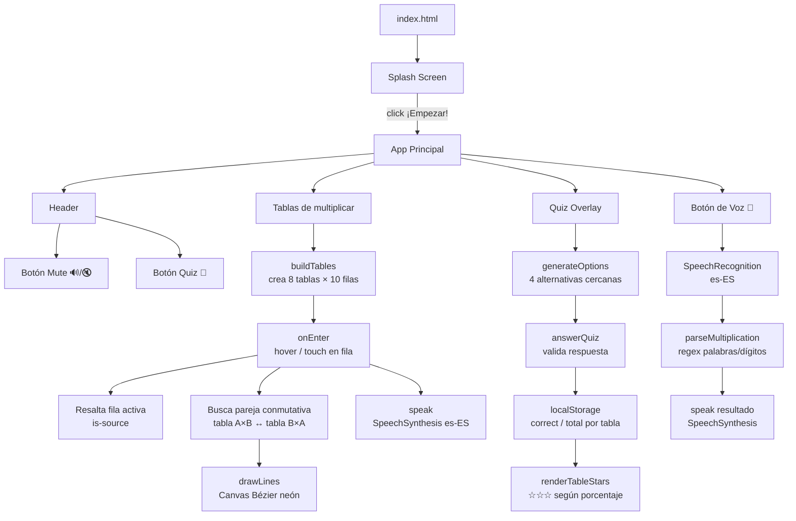
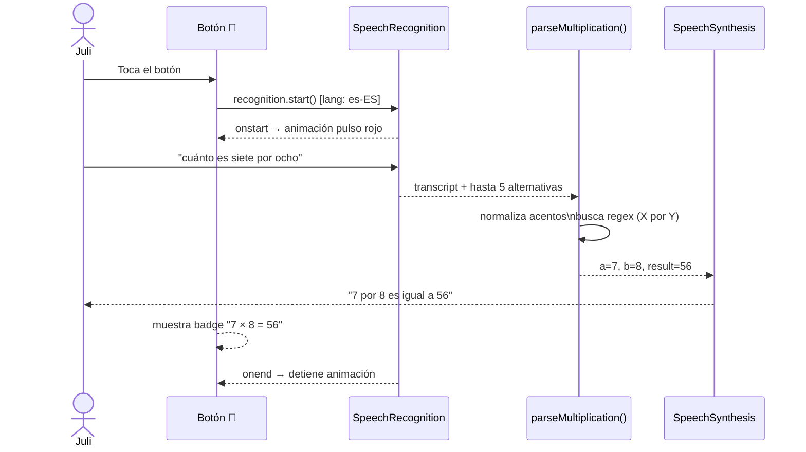
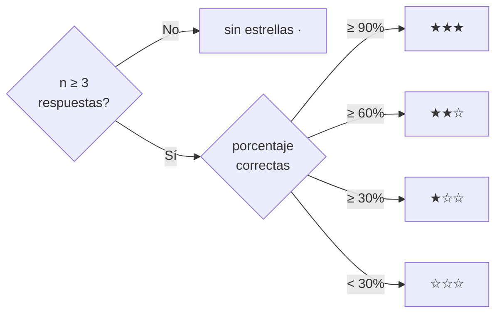

# Tablas para Juli 🎓

> Nació del amor de un papá que quería ayudar a su hija Julieta a aprender las tablas de multiplicar.

[](https://yamicueto.github.io/tablas-para-juli/)


Visualización interactiva de las tablas del 2 al 9 con conexiones cruzadas (propiedad conmutativa), quiz adaptativo, narración por voz y **reconocimiento de voz en español** — sin instalar nada.

---

## Características

| Módulo | Descripción |
|---|---|
| 🎨 **Tablas visuales** | Tablas del 2 al 9 con color único por tabla, animación al entrar |
| 🔗 **Conexión conmutativa** | Líneas de Bézier en Canvas que unen pares (ej: 3×7 ↔ 7×3) |
| 🔊 **Voz automática** | Narra cada operación en español con `SpeechSynthesis` |
| 🧠 **Quiz interactivo** | 10 rondas aleatorias con feedback, estrellas por tabla y progreso persistente |
| 🎤 **Control por voz** | Botón flotante: di "cuánto es 7 por 8" y responde en voz alta |
| 📱 **Mobile first** | Scroll-snap, dots de navegación y soporte táctil completo |

---

## Arquitectura de la app



---

## Flujo del reconocimiento de voz



---

## Sistema de estrellas del Quiz



Los resultados se guardan en `localStorage` por tabla (clave `quiz_t2` … `quiz_t9`) y persisten entre sesiones.

---

## Tecnologías

- **HTML5** semántico
- **CSS3** — variables, scroll-snap, Canvas, animaciones, `backdrop-filter`
- **JavaScript vanilla** — Canvas API · Web Speech API (Synthesis + Recognition)
- Sin frameworks · Sin dependencias · Compatible con GitHub Pages

---

## Estructura del proyecto

```
tablas-para-juli/
├── index.html      # Estructura y metadatos Open Graph / Twitter Card
├── styles.css      # Estilos mobile-first + responsive (600px / 1024px)
└── app.js          # Lógica completa: tablas, canvas, quiz, voz
```

---

## Cómo ejecutar

Abre `index.html` directamente en cualquier navegador moderno. No requiere servidor ni instalación.

> **Nota sobre el micrófono:** el reconocimiento de voz requiere HTTPS o `localhost`. En GitHub Pages funciona de fábrica.

---

## Demo

🌐 [yamicueto.github.io/tablas-para-juli](https://yamicueto.github.io/tablas-para-juli/)

---

Hecho con ❤️ para Julieta.
